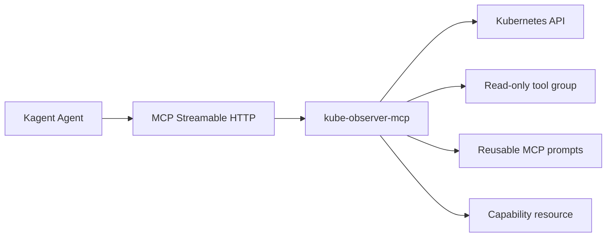

# kube-observer-mcp

An open-source MCP server providing concise, read-only Kubernetes inventory
tools for AI agents.

The first release exposes two typed tools:

- `list_nodes`: node name, Ready condition, Kubernetes version, OS, architecture.
- `list_pods(namespace)`: pod name, namespace, phase, ready container count,
  restart count.

It deliberately does not expose arbitrary `kubectl`, shell execution, Secrets,
container environment, or mutation operations. The default Kubernetes RBAC only
grants `get` and `list` on Nodes and Pods.

The multi-stage, lockfile-driven container is about 57 MB, uses the slim Debian
Python runtime, runs as UID 10001, drops Linux capabilities, uses a read-only
root filesystem with a bounded `/tmp`, and exposes a `/health` endpoint for
container and Kubernetes probes. The base remains Debian slim because the
Kubernetes and cryptography dependencies have well-tested wheels there; Alpine
could introduce native-build complexity for little practical size gain. GHCR
releases include BuildKit provenance and an SBOM attestation.

## Architecture



Tool groups are registered explicitly in `src/kube_observer_mcp/tools/registry.py`.
Only `read_only` is registered by default. Future write-capable groups should
be separate modules, require explicit enablement, and ship with distinct
least-privilege RBAC and tests. MCP prompts provide reusable workflows; they do
not grant permissions.

## Requirements

- Python 3.11+
- `uv`
- Docker for image builds
- A Kubernetes cluster for deployment

## Local Development

Install dependencies and run tests:

```sh
uv sync --extra dev
uv run pytest
```

Run locally against an explicit kubeconfig:

```sh
KUBECONFIG=/path/to/kubeconfig uv run kube-observer-mcp
```

The Streamable HTTP endpoint listens on `0.0.0.0:8000/mcp`. Use the official
[MCP Inspector](https://github.com/modelcontextprotocol/inspector) or another
MCP client to list and call `list_nodes` and `list_pods`. For the homelab, the
private repo's K3d kubeconfig can be supplied without copying it into this repo:

```sh
KUBECONFIG=/absolute/path/to/homelab/.kube/noel-lab.yaml uv run kube-observer-mcp
```

For a local tool check from Python:

```sh
uv run python - <<'PY'
import asyncio
from mcp import Client

async def main():
	async with Client("http://127.0.0.1:8000/mcp") as client:
		print(await client.list_tools())
		print(await client.call_tool("list_nodes", {}))
		print(await client.call_tool("list_pods", {"namespace": "kagent"}))

asyncio.run(main())
PY
```

The repository's unit tests use mock Kubernetes objects and require no cluster.
The K3d homelab integration check also confirmed that the tools return only the
requested summary fields for Nodes and Pods.

## Kubernetes Deployment

Images are published to GitHub Container Registry when a version tag is pushed.
The workflow runs tests first and publishes multi-platform `linux/amd64` and
`linux/arm64` images. From the repository root:

```sh
git tag v0.1.0
git push origin v0.1.0
```

The image will be tagged as `0.1.0`, `0.1`, the commit SHA, and `latest`. On
first publication, open the package's GitHub settings and set its visibility to
Public if this repository's deployment is meant to be public. Check the image
name in `deploy/kubernetes/deployment.yaml` before changing it for a fork.

Apply the server namespace, ServiceAccount, and read-only RBAC:

```sh
kubectl apply -f deploy/kubernetes/rbac.yaml
kubectl apply -f deploy/kubernetes/deployment.yaml
kubectl rollout status deployment/kube-observer-mcp -n kube-observer-mcp
```

4. Register the server and example Agent with Kagent:

```sh
kubectl apply -f deploy/kagent/remote-mcp-server.yaml
kubectl apply -f deploy/kagent/agent-homelab-inventory.yaml
```

The MCP endpoint is a ClusterIP service, not exposed publicly. Keep network
access restricted to trusted in-cluster clients. Review the RBAC manifest and
cluster boundary before deploying into production.

The Kagent integration manifests live separately in `deploy/kagent/`. They
register a `RemoteMCPServer` in Kagent's namespace and provide an example Agent
that selects only `list_nodes` and `list_pods`.

## Extending The Server

Add new read-only tools in a focused module under
`src/kube_observer_mcp/tools/`, then explicitly register that module in the
tool-group registry. The `create_server(tool_groups=...)` factory takes an
explicit group list; `main()` uses only `read_only`. Unknown groups fail closed.
Add unit tests for response shape and error handling.

Reusable workflows belong in `src/kube_observer_mcp/prompts.py`; MCP resources
belong beside server construction and should expose only intentionally public
metadata. Prompts are guidance, not authorization. Kubernetes RBAC remains the
enforcement boundary. Never add a generic command-execution tool. A future
mutation feature must be an explicit separate tool group with separate RBAC,
human approval, tests, and documentation.

The server currently exposes MCP prompt templates as reusable workflows; these
are not the same as a model-vendor-specific “Agent Skills” package. A future
skills adapter can be added separately without coupling tool authorization to
prompt content.

## License

MIT. See [LICENSE](LICENSE).
